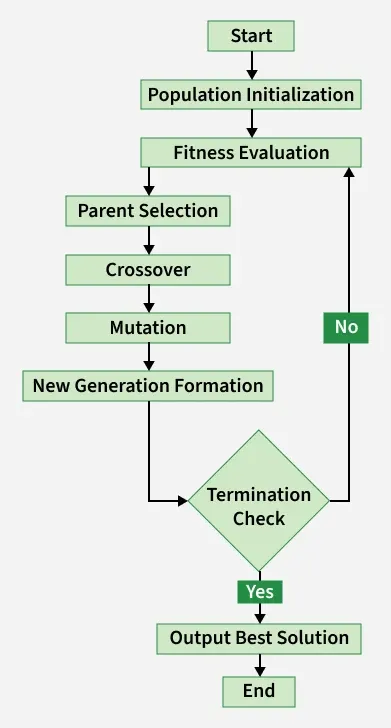

# Глава 2. Алгоритмы составления расписания

## 2.1 Генетический алгоритм (Genetic Algorithm)

### 1. Идея и происхождение

Алгоритм основан на принципах **естественного отбора** и эволюционных вычислений.
Изначально метод был предложен для поиска глобального экстремума целевой функции в многомерном пространстве решений.
В обобщенной постановке задача составления расписания (timetabling) относится к классу **NP-трудных**, а отдельные ее варианты являются NP-полными. Поэтому точное решение методом полного перебора для реалистичных размерностей, как правило, практически неосуществимо (Kan, 2012; Błażewicz et al., 2007; Вусик, 2025). В таких условиях ГА позволяет получать **приближенные решения** за приемлемое на практике время, сочетая элементы перебора с направленным эвристическим поиском (Низамова, 2006; Вусик, 2025).

### 2. Ключевые компоненты

Базовые термины алгоритма:

* **Популяция:** Множество особей (вариантов расписания).
* **Особь (индивидуум):** Конкретное решение задачи, состоящее из набора хромосом.
* **Хромосома:** Упорядоченная последовательность генов, кодирующая параметры решения.
* **Ген:** Атомарный элемент решения (например, информация об одном занятии).
* **Генотип и фенотип:** Совокупность генов особи и набор соответствующих им значений параметров задачи.
* **Аллель:** Конкретное значение определенного гена (например, номер аудитории).
* **Функция приспособленности (fitness function):** Мера «качества» решения, на основе которой происходит отбор лучших особей.

### 3. Алгоритм работы

Пошаговый цикл итерации выглядит следующим образом (рисунок 2.1):

1. **Инициализация:** Формирование начальной популяции (случайным образом или на основе эвристик).
2. **Основной цикл (поколения):**
    * **Применение операторов:**
        * **Мутация:** Случайное изменение значений генов в хромосомах для поддержания генетического разнообразия.
        * **Скрещивание (кроссинговер):** Обмен участками хромосом между родительскими особями для создания потомков.
    * **Оценка:** Расчет функции приспособленности для каждой особи.
    * **Селекция:** Отбор особей в новое поколение на основе приспособленности (например, турнирный отбор или рулетка) с возможным применением элитизма.
3. **Критерий останова:** Стабилизация лучшего значения функции приспособленности в течение нескольких поколений, достижение целевого порога качества или выполнение заданного числа итераций.
4. **Выбор решения:** Выбор лучшей особи из последнего поколения.



*Рисунок 2.1 - Типовая схема цикла генетического алгоритма.*

### 4. Применение к задаче составления расписания

В задачах расписания ген обычно интерпретируется как учебное занятие, содержащее фиксированные и изменяемые параметры, включая аудиторию, день и время. В ряде работ используются агрегативные схемы кодирования, где особь представлена двумя взаимосвязанными хромосомами, отдельно отвечающими за пространственное и временное распределение занятий (Низамова, 2006; Вусик, 2025). Жесткие ограничения (hard constraints), например отсутствие конфликтов по преподавателям и группам, задают обязательную часть модели и учитываются либо через высокие штрафы, либо через ограничение допустимых значений генов. Мягкие ограничения (soft constraints), включая минимизацию «окон» и учет предпочтений преподавателей, встраиваются в целевую функцию с меньшими весами (Толстых и Толстых, 2014; Вусик, 2025).

### 5. Сложность и эффективность

Основные вычислительные затраты в ГА связаны с оценкой функции приспособленности, то есть с проверкой выполнения ограничений для большого числа кандидатов (Низамова, 2006; Вусик, 2025). По мере роста размерности задачи алгоритм обычно сохраняет более гибкую масштабируемость по сравнению с точными методами, однако требует увеличения вычислительных ресурсов и размера популяции для удержания качества решений (Kan, 2012; Кононов и Фуругян, 2025). При этом сохраняется риск преждевременной сходимости к локальному оптимуму, поэтому на практике применяются адаптивные схемы мутации, вариативные стратегии селекции и механизмы поддержания разнообразия (Нассер, 2017; Вусик, 2025).

### 6. Преимущества и недостатки в контексте расписания

В литературе по задачам расписания обычно выделяются следующие сильные и слабые стороны ГА (Низамова, 2006; Нассер, 2017; Вусик, 2025).

К основным преимуществам генетического алгоритма относят способность находить практически приемлемые решения в задачах большой размерности, гибкость настройки весов ограничений и возможность получать несколько конкурентных вариантов расписания в рамках одного запуска. Кроме того, в любой момент итерационного процесса доступно текущее лучшее решение, что важно для прикладных систем с ограниченным временем расчета.

Ограничения метода связаны с отсутствием гарантии глобального оптимума, чувствительностью к качеству начальной популяции и повышенной вычислительной трудоемкостью на поздних стадиях поиска. При неудачной настройке операторов эволюции возможна преждевременная сходимость и фиксация в локальном оптимуме.

### 7. Примеры использования

Практическое применение ГА в сфере образовательного расписания иллюстрируется, в частности, программным комплексом «Феб», основанным на агрегативных моделях (Низамова, 2006). В вузовских кейсах также описаны автоматизированные решения на базе метаэвристик, где генетический алгоритм используется как самостоятельный метод или как компонент гибридной схемы оптимизации (Вусик, 2025; Толстых и Толстых, 2014). Обзорные работы дополнительно подтверждают устойчивый интерес к эволюционным и гибридным подходам в задачах составления расписаний (Нассер, 2017; Гончаров и Войтешенко, 2026).

### 8. Вывод

Генетический алгоритм является эффективным инструментом метаэвристического поиска и широко применяется для сложных организационных задач, включая составление расписания в вузах (Низамова, 2006; Вусик, 2025). Его практическая результативность зависит от **корректной формулировки функции приспособленности**, выбора операторов эволюции и учета предметных связей между объектами (преподаватель - группа - аудитория) (Толстых и Толстых, 2014; Кононов и Фуругян, 2025). При этом качество итогового расписания определяется не только самим методом оптимизации, но и корректностью постановки ограничений и параметров модели.

```{=openxml}
<w:p>
  <w:r>
    <w:br w:type="page"/>
  </w:r>
</w:p>
```
