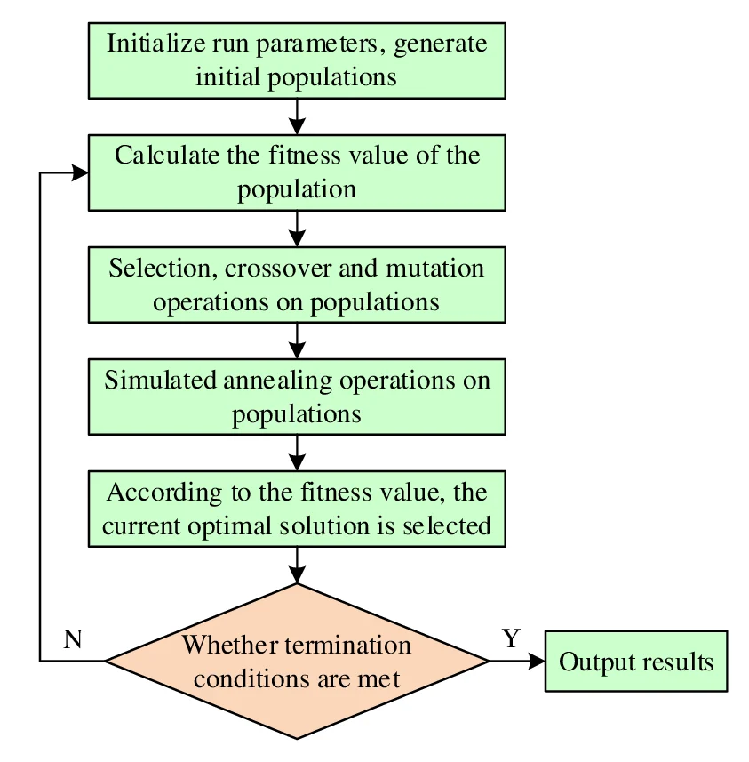

## 2.2 Имитация отжига(Simulated Annealing)

### 1. Идея и происхождение

* **Природная метафора:** Алгоритм вдохновлен процессом **термического отжига в металлургии**, при котором металл нагревается до высокой температуры, а затем медленно охлаждается. Это позволяет атомам переходить из состояний с высокой энергией в более стабильные конфигурации с минимальной энергией, устраняя дефекты кристаллической решетки.
* **Область происхождения и решаемые задачи:** Изначально метод был предложен для моделирования поведения систем атомов, но позже адаптирован для задач глобальной оптимизации.
* **Применимость к NP-трудным задачам:** Задачи составления расписания часто являются **NP-трудными** из-за огромного пространства возможных решений и динамических условий. SA подходит для них, так как способен эффективно исследовать большие пространства поиска и, в отличие от простых «жадных» алгоритмов, **избегать застревания в локальных оптимумах**.

### 2. Формальная модель / ключевые компоненты

Базовый словарь алгоритма включает:

* **Состояние ($S$ или $\sigma$):** Текущее решение (например, распределение задач по узлам или сотрудникам).
* **Температура ($T$):** Параметр управления, который определяет вероятность принятия «худших» решений. Она постепенно снижается в процессе работы.
* **Функция стоимости (Cost Function):** Критерий оценки качества решения (например, общее время выполнения или финансовые затраты).
* **Генерация соседа (Neighbor Generation):** Процесс внесения небольших случайных изменений в текущее решение для получения нового кандидата.
* **Критерий принятия (правило Метрополиса):** Вероятностная функция, решающая, принимать ли новое решение. Если новое решение лучше, оно принимается всегда; если хуже — с вероятностью $P = \exp(-\Delta Cost / T)$.

### 3. Алгоритм работы

Процесс включает следующие этапы:

1. **Инициализация:** Создается начальное случайное решение $\sigma(0)$ и устанавливается высокая начальная температура $T_0$.
2. **Основной цикл (итерации):**
    * Создание «соседнего» решения путем изменения одного элемента (например, переноса задачи на другой узел).
    * Оценка изменения стоимости $\Delta Cost = Cost(New) - Cost(Current)$.
    * Принятие решения на основе правила Метрополиса.
3. **Охлаждение:** Температура снижается согласно выбранному графику (например, геометрическому: $T_{k+1} = \tau T_k$, где $\tau \in [0.90, 0.99]$).
4. **Критерий останова:** Алгоритм завершается, когда температура падает ниже минимального порога ($T_{min}$) или достигнуто максимальное число итераций.



### 4. Применение к задаче составления расписания

* **Кодирование решения:** Используется прямое кодирование (direct encoding), где решение представляется как отображение задач на исполнителей или ресурсы.
* **Жёсткие ограничения (hard constraints):** При назначении задач среда контролирует выполнение критических условий, таких как минимальное время отдыха между сменами, максимальное рабочее время или зависимости задач в графе (DAG).
* **Мягкие ограничения (soft constraints):** Учитываются через **многокритериальную функцию стоимости**. В нее интегрируются штрафы за нарушение приоритетов задач, избыточное энергопотребление, стоимость выполнения и надежность.

### 5. Сложность и эффективность

* **Вычислительная сложность:** Сложность одной итерации может составлять $O(n \cdot k)$, где $n$ — число задач, а $k$ — число узлов/ресурсов. Использование **инкрементального пересчета стоимости** (когда учитываются только измененные части расписания) значительно ускоряет процесс.
* **Масштабируемость:** SA демонстрирует хорошую масштабируемость при росте размерности задачи, сохраняя преимущество над классическими методами (ACO, PSO) на больших наборах данных (до 1000 задач).
* **Сходимость:** Скорость сходимости зависит от скорости охлаждения. Медленное охлаждение ведет к более высокому качеству, но требует больше времени. Способность принимать ухудшающие шаги на высоких температурах критически важна для выхода из локальных минимумов.

### 6. Преимущества и недостатки в контексте scheduling

**Преимущества:**

* Глобальный поиск: Способен избегать локальных оптимумов, в отличие от жадных алгоритмов.
* Гибкость: Легко адаптируется под новые ограничения через изменение функции штрафов.
* Многокритериальность: Эффективно балансирует время, стоимость, энергию и приоритеты.

**Недостатки:**

* Настройка параметров: Сложно подобрать идеальную начальную температуру и скорость охлаждения.
* Время работы: Для достижения оптимального результата при очень сложных задачах может требоваться много итераций.
* Стохастичность: Результаты могут незначительно отличаться от запуска к запуску.

### 7. Примеры использования

1. **Fog Computing Task Scheduling:** В современных исследованиях SA применяется для распределения задач в туманных вычислениях, оптимизируя время выполнения и энергопотребление с учетом приоритетов.
2. **Job Shop Scheduling:** Алгоритм используется в промышленности для оптимизации производственных графиков в цехах.
3. **Crew Scheduling:** Хотя в некоторых транспортных задачах сейчас преобладает обучение с подкреплением (RL), SA остается классическим базовым методом для сравнения и решения задач расписания экипажей.

### 8. Вывод по алгоритму

Алгоритм имитации отжига является **надежным и универсальным инструментом** для автоматизации составления расписаний. Его главная сила заключается в сочетании случайного поиска и направленного улучшения, что позволяет находить решения, близкие к оптимальным, в условиях жестких и мягких ограничений современных динамических систем.

```{=openxml}
<w:p>
  <w:r>
    <w:br w:type="page"/>
  </w:r>
</w:p>
```
