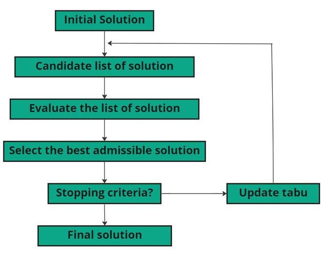

## 2.3 Поиск с запретами (Tabu Search)

### 1. Идея и происхождение

* **Происхождение и метафора:** Алгоритм был предложен Фредом Гловером в конце 1980-х годов. Его основная идея имитирует **человеческую память** и способность к адаптивному обучению.
* **Изначальная задача:** Алгоритм создавался для решения сложных комбинаторных задач дискретной оптимизации.
* **Пригодность для NP-трудных задач:** Поиск с запретами эффективно исследует пространство решений, поочередно ограничивая (через списки запретов) и освобождая (через критерии аспирации) локальный поиск. Это позволяет алгоритму выходить из локальных оптимумов, что критически важно для таких задач, как составление расписаний (JSP) или распределение ресурсов.

### 2. Формальная модель / ключевые компоненты

Базовый словарь понятий алгоритма включает:

* **Текущее решение ($x$):** Конкретное состояние расписания или конфигурация объектов в текущий момент.
* **Окрестность ($N(x)$):** Множество всех возможных решений, которые могут быть достигнуты из текущего за один «шаг» или «ход».
* **Список запретов (Tabu List):** Структура памяти, хранящая атрибуты недавно выполненных ходов, которые временно запрещено повторять, чтобы избежать зацикливания.
* **Срок запрета (Tabu Tenure):** Количество итераций, в течение которых ход остается запрещенным.
* **Критерий аспирации (Aspiration Criterion):** Правило, позволяющее выполнить запрещенный ход, если он ведет к решению, которое лучше текущего глобального максимума/минимума.
* **Механизм обучения (Learning):** Использование классификаторов (логистическая регрессия, деревья решений) или векторов вероятностей (RL) для предсказания наиболее перспективных областей окрестности.

### 3. Алгоритм работы

Пошаговый цикл итерации выглядит следующим образом:

1. **Инициализация:** Генерация начального допустимого (или недопустимого) решения $x_0$ (например, случайным образом или с помощью жадного алгоритма).
2. **Основной цикл:**
    * **Сбор данных ($T_{collect}$):** Накопление информации о поведении поискового пространства на первых этапах.
    * **Обучение и фильтрация:** Обучение модели предсказывать «перспективность» соседей. Вместо оценки всей окрестности $N(x)$ оценивается лишь её подмножество $N'(x)$, отобранное моделью.
    * **Выбор хода:** Выбирается лучший ход из незапрещенных (или соответствующих критерию аспирации).
    * **Обновление:** Обновление списка запретов, текущего и лучшего найденного решения.
3. **Критерий останова:** Достижение временного лимита, максимального числа итераций или отсутствие улучшений в течение заданного времени.



### 4. Применение к задаче составления расписания

* **Кодирование решения:** Прямое (матрица назначений врач-пациент-время) или непрямое на основе заданий (job-based encoding), где хромосома представляет собой последовательность номеров работ.
* **Жёсткие ограничения (Hard constraints):** Включают доступность оборудования/персонала, запрет на прерывание операций и соблюдение технологических маршрутов (например, в задачах Job Shop).
* **Мягкие ограничения (Soft constraints):** Предпочтения врачей по сменам, минимизация общего времени завершения всех работ (makespan) или сокращение времени ожидания пациента.

### 5. Сложность и эффективность

* **Вычислительная сложность:** Для задачи Job Shop сложность одной итерации с базовыми перемещениями составляет $O(nm)$; использование сложных структур (N8T+2MT) повышает её до $O(nm^2)$.
* **Рост размерности:** Поисковое пространство растет экспоненциально при увеличении числа работ ($n$) или машин ($m$).
* **Сходимость и локальные оптимумы:** TS использует память для выхода из тупиков. Механизмы **обучения с подкреплением (RL)** или классификации позволяют алгоритму фокусироваться на перспективных зонах (точность предсказания около 50-70%), что ускоряет сходимость. Обучение позволяет находить качественные решения за меньшее число итераций и вычислений, чем стандартный TS.

### 6. Преимущества и недостатки в контексте расписаний

* **Плюсы:**
  * Мощный механизм локального поиска;
  * Эффективность в стохастических условиях (например, при неопределенности времени прибытия пациентов).
* **Минусы:**
  * Высокая чувствительность к гиперпараметрам (размер списка запретов, размер окрестности);
  * Риск зацикливания при слишком коротком сроке запрета;
  * Вычислительная емкость при оценке огромных окрестностей в реальных задачах.

### 7. Примеры использования

1. **HGTSA (Hybrid Genetic Tabu Search Algorithm):** Гибридная система для задач Job Shop Scheduling, использующая структуру окрестностей N8T+2MT.
2. **L-TS (Learning Tabu Search):** Алгоритм, применяемый для **составления расписаний врачей** в онкологических центрах, где логистическая регрессия помогает предсказывать лучшие перестановки в графике.

### 8. Вывод по алгоритму

Алгоритм поиска с запретами остается одной из наиболее надежных метаэвристик для задач расписания благодаря своей гибкости и памяти. Внедрение методов машинного обучения (L-TS) делает его «интеллектуальным», позволяя существенно сократить время поиска за счет сужения исследуемой окрестности без потери качества решения.

```{=openxml}
<w:p>
  <w:r>
    <w:br w:type="page"/>
  </w:r>
</w:p>
```
