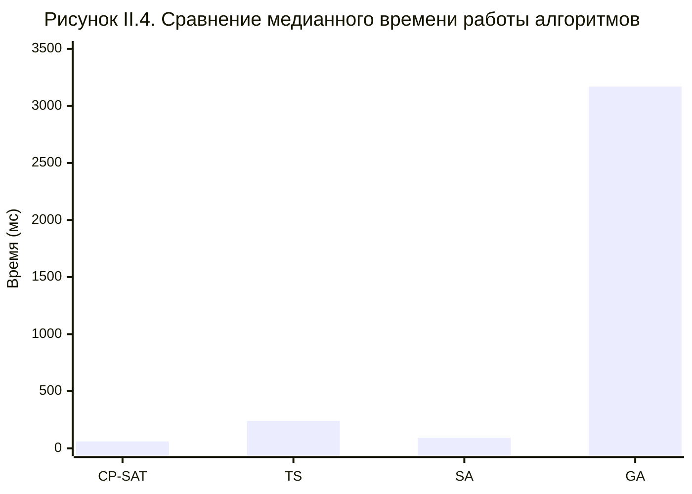
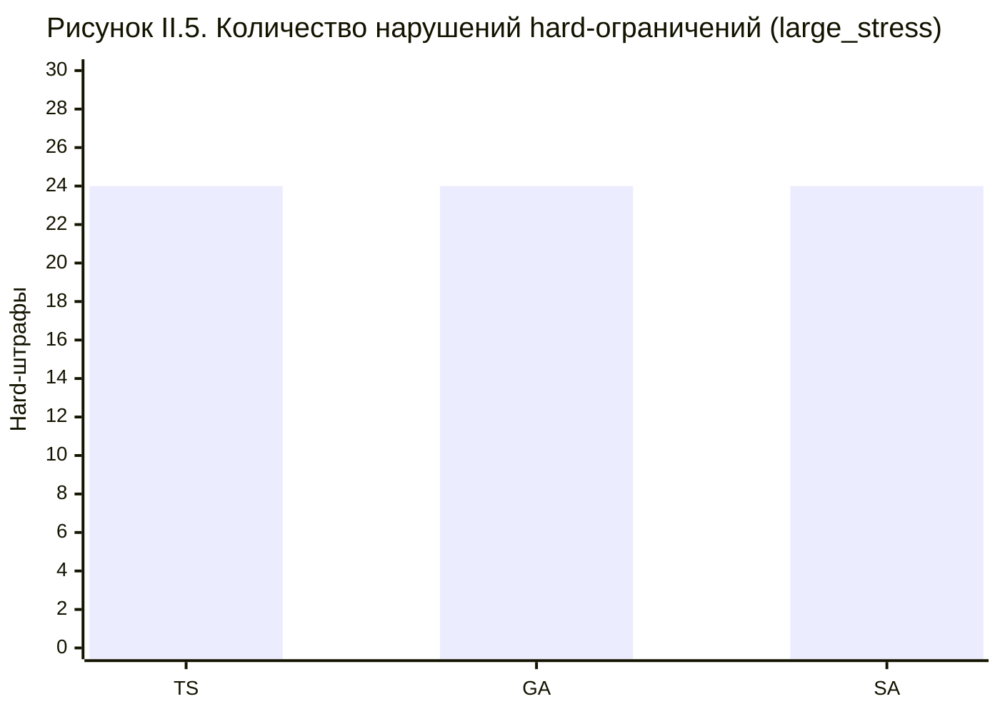
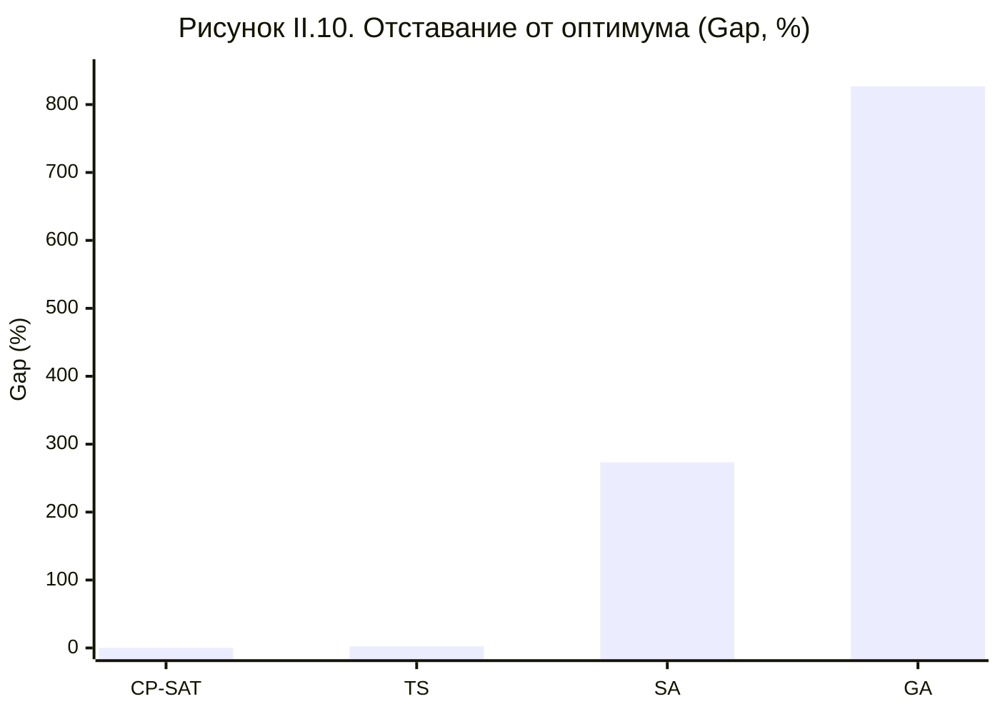
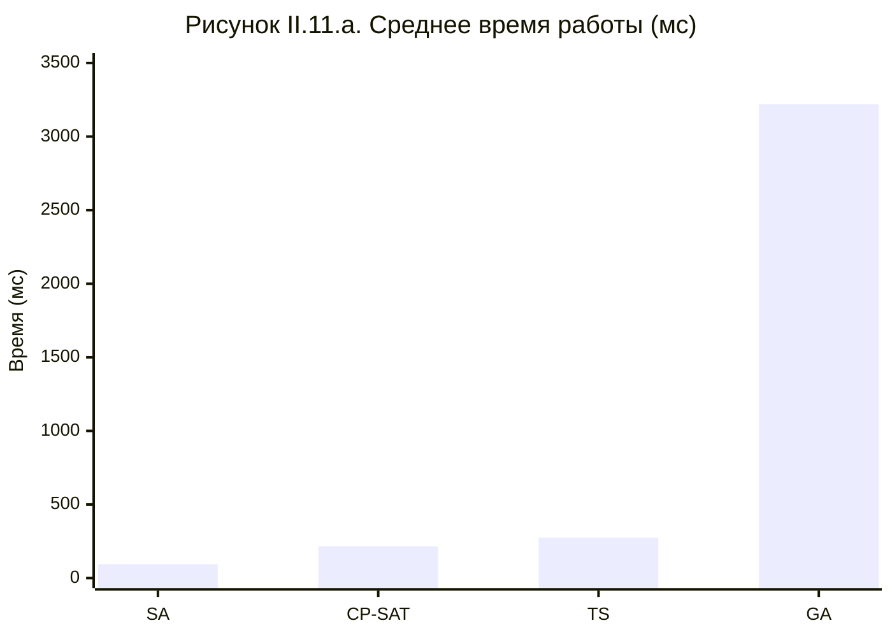
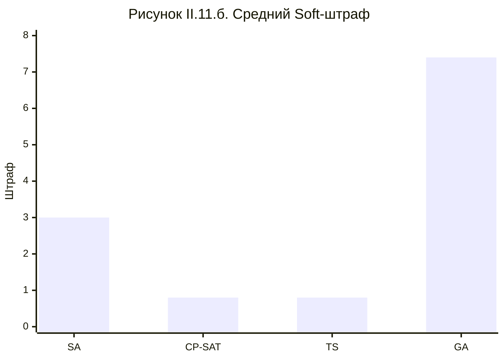

# II.5. Сравнительный анализ алгоритмов

## Методика сравнения

Сравнение четырёх алгоритмов строилось на единой модели данных и едином критерии оценки качества решения — паре чисел «количество нарушенных жёстких ограничений, суммарный штраф по мягким ограничениям», вычисляемой одной и той же функцией независимо от того, какой алгоритм построил расписание. Без этого условия сравнение было бы лишено смысла: разные единицы измерения качества у разных алгоритмов сделали бы любые числовые выводы недостоверными.

Сравнение проводилось по двум независимым осям, которые отвечают на разные вопросы и не должны подменять друг друга. Первая ось — повторные запуски одного и того же алгоритма на одном и том же наборе данных с разными случайными начальными значениями (от одного до десяти запусков на комбинацию алгоритма и набора данных). Эта ось отвечает на вопрос об устойчивости результата: насколько сильно качество решения, найденного генетическим алгоритмом, имитацией отжига или поиском с запретами, зависит от случайности, заложенной в эти методы. Вторая ось — использование нескольких наборов исходных данных разного размера и разной степени структурной сложности. Эта ось отвечает на принципиально другой вопрос: насколько обнаруженные закономерности обобщаются за пределы одного конкретного набора данных. Подмена одной оси другой — типичная методическая ошибка при сравнении эвристических алгоритмов: устойчивый результат на единственном наборе данных ничего не говорит о том, как алгоритм поведёт себя на задаче другого размера.

Дополнительно как точка опоры использовался метод полного перебора с откатом — переборный алгоритм, не входящий в основной список сравниваемых методов, но применённый для подтверждения корректности остальных реализаций на заведомо малых, заранее проверяемых вручную фрагментах задачи. Поскольку полный перебор для задачи такого размера, как использованные в основном эксперименте наборы данных, физически неосуществим за разумное время, его роль ограничена ролью независимого арбитра на крошечных тестовых случаях, а не участника основного сравнения.

## Наборы данных

Для эксперимента были подготовлены четыре синтетических набора данных программным генератором, не зависящим от системы управления базами данных, что позволило точно контролировать как размер задачи (число дисциплин, аудиторий, преподавателей), так и её структурную сложность (число преподавателей, квалифицированных по каждой дисциплине, и число типов аудиторий, подходящих под каждую дисциплину) независимо друг от друга.

| Набор данных | Занятий | Структурная сложность | Особенность |
|---|---|---|---|
| tiny_easy | 9 | низкая (много вариантов на каждое занятие) | минимальный показательный случай |
| small_tight | 11 | высокая (минимум вариантов на каждое занятие) | малый размер при тугих ограничениях |
| medium | 26 | средняя | основной показательный случай среднего масштаба |
| large_stress | 54 | вместимость учебной сетки заведомо меньше числа занятий | намеренно структурно неразрешимый случай |

Набор `large_stress` заслуживает отдельного пояснения. Изначально он задумывался как стресс-тест на крупном, но разрешимом объёме данных, однако при заданных параметрах учебной сетки (шесть дней, семь пар в день — сорок два доступных слота) и двадцати пяти дисциплин с учётом лекционных, семинарских и лабораторных занятий суммарное число занятий, которые требовалось расставить, составило пятьдесят четыре — больше, чем физически доступных слотов. В результате этот набор данных оказался не просто «большим», а структурно неразрешимым: ни один из четырёх алгоритмов не может построить расписание без хотя бы одного нарушения жёсткого ограничения, какой бы метод и сколько бы времени ни использовалось. Решение оставить этот набор данных в эксперименте, а не исключить его как ошибочный, было принято осознанно: именно на нём наиболее наглядно проявляется разница между точным и эвристическими методами в части способности корректно распознать отсутствие решения, а не просто не найти его.

## Результаты на разрешимых наборах данных

Таблица ниже обобщает результаты на трёх наборах данных, для которых допустимое решение существует. Во всех случаях все четыре алгоритма находили решение без единого нарушения жёстких ограничений на каждом из десяти запусков; различие — в качестве решения по мягким критериям и в затраченном времени.

| Набор данных | Алгоритм | Среднее значение мягкого штрафа | Отклонение от наилучшего найденного | Среднее время, мс |
|---|---|---|---|---|
| tiny_easy | CP-SAT | 0.160 | 0.0% | 51 |
| tiny_easy | TS | 0.160 | 0.0% | 83 |
| tiny_easy | GA | 0.160 | 0.0% | 1280 |
| tiny_easy | SA | 0.382 | 138.9% | 53 |
| small_tight | CP-SAT | 5.615 | 0.0% | 59 |
| small_tight | TS | 5.615 | 0.0% | 57 |
| small_tight | GA | 5.615 | 0.0% | 1530 |
| small_tight | SA | 5.615 | 0.0% | 58 |
| medium | CP-SAT | 0.799 | 0.0% | 210 |
| medium | TS | 0.818 | 2.4% | 272 |
| medium | SA | 2.984 | 273.4% | 92 |
| medium | GA | 7.407 | 826.8% | 3210 |

Картина устойчиво повторяется на всех трёх наборах данных и становится тем отчётливее, чем больше размер задачи. На самом простом наборе (`tiny_easy`) различие между алгоритмами почти не проявляется — задача настолько слабо ограничена, что любой из методов с лёгкостью находит решение, близкое к оптимальному, кроме имитации отжига, чьё среднее значение штрафа заметно выше из-за случайных неудачных запусков (на двух из десяти запусков итоговый штраф оказался существенно выше, чем на остальных восьми, что отражает чувствительность метода к случайному стартовому состоянию на отдельных запусках). На наборе данных с тугими ограничениями (`small_tight`) все четыре алгоритма сошлись к одному и тому же значению на всех запусках без исключения — структура задачи здесь настолько жёстко определена малым числом допустимых комбинаций, что фактически не оставляет алгоритмам выбора. Наиболее показательный случай — набор данных среднего размера (`medium`), на котором различие между алгоритмами проявляется наиболее ярко: поиск с запретами почти не отстаёт от доказанно оптимального решения, найденного решателем ограничений, имитация отжига отстаёт примерно втрое, а генетический алгоритм — почти на порядок, при этом затрачивая на порядок больше времени, чем любой из трёх остальных методов.

### Анализ производительности и устойчивости алгоритмов

Сравнение медианных показателей времени выполнения демонстрирует существенный разрыв между математическим солвером и эвристическими методами. Генетический алгоритм требует значительно больших вычислительных ресурсов при достижении сопоставимого с TS качества.

*Рисунок II.4. Медианное время выполнения алгоритмов (wall_time_ms)*

*Рисунок II.5. Сравнение нарушений hard-ограничений на датасете large_stress*

### Анализ разброса показателей (устойчивость)

Мы проанализировали устойчивость методов к смене начального состояния (seed). Эвристические методы, особенно имитация отжига, демонстрируют выраженную вариативность на малых размерностях.

*Рисунок II.6. Разброс значений soft-штрафа (диапазон min–max)*

```mermaid
gantt
    title "Рисунок II.6. Диапазоны разброса soft-штрафов по датасетам"
    dateFormat  X
    axisFormat %s

    section tiny_easy
    CP-SAT/TS/GA (0.16) : 0, 1
    SA (0.16–1.27)      : 0, 13

    section medium
    CP-SAT (0.79)       : 7, 8
    TS (0.79–0.99)      : 7, 10
    SA (1.95–4.45)      : 19, 45
    GA (5.79–8.05)      : 57, 81

```

### Эффективность эвристик в сравнении с точным методом

Для оценки качества алгоритмов мы использовали метрику «отставания от лучшего решения» (Gap to Best). Эксперименты на датасете `small_tight` показали, что все рассматриваемые методы достигают глобального оптимума (0% отставания). Напротив, при усложнении задачи (датасет `medium`) методы начинают демонстрировать значительную дифференциацию результатов.

*Рисунок II.10. Отставание от глобального оптимума по датасетам*

### Анализ компромисса: время выполнения и качество решения

Мы сопоставили временные затраты алгоритмов с качеством итоговых расписаний (на примере датасета `medium`). Анализ данных позволяет сделать вывод о конкурентоспособности методов:

1. **Точность и эффективность:** CP-SAT и метод поиска с запретами (TS) обеспечивают оптимальный баланс, находя решения с минимальным штрафом (~0.8) за доли секунды.
2. **Скорость в ущерб качеству:** Метод имитации отжига (SA) является наиболее быстрым, однако это ведет к снижению качества итогового расписания.
3. **Ресурсная избыточность:** Генетический алгоритм (GA) демонстрирует наиболее высокую вычислительную сложность при наихудших показателях качества среди исследованных методов.

*Рисунок II.11. Сравнение производительности и качества (medium)*

## Особый случай: структурно неразрешимый набор данных

На наборе данных `large_stress` ни один из четырёх алгоритмов не нашёл допустимого решения, и для трёх эвристических методов число нарушений жёстких ограничений составило ровно двадцать четыре на каждом из десяти запусков без единого исключения — то есть совпало не приблизительно, а точно у всех трёх независимо реализованных методов. Решатель ограничений на этом же наборе данных строго доказал отсутствие допустимого решения вовсе. Поскольку ни одно из решений не является допустимым, сравнение по относительному отклонению от наилучшего найденного решения здесь неприменимо: имеет смысл сравнивать только сам остаточный штраф по мягким критериям при одинаковом, не сводимом к нулю числе жёстких нарушений, а также скорость, с которой каждый метод приходит к этому выводу.

| Алгоритм | Нарушений жёстких ограничений | Среднее значение мягкого штрафа | Среднее время, мс |
|---|---|---|---|
| CP-SAT | доказано: решения не существует | — | 13 |
| TS | 24 | 0.028 | 828 |
| SA | 24 | 3.676 | 148 |
| GA | 24 | 11.148 | 6185 |

Совпадение числа жёстких нарушений у всех трёх эвристик — само по себе значимый результат: оно подтверждает, что структурный дефицит слотов (двадцать четыре занятия, для которых физически не нашлось свободного времени из пятидесяти четырёх) — объективное свойство самой задачи, а не особенность конкретного алгоритма или конкретного случайного запуска. При равном, неустранимом числе жёстких нарушений различие между методами проявляется только в том, насколько хорошо каждый из них распоряжается оставшейся свободой выбора среди тех решений, которые всё равно вынуждены нарушать ограничения: поиск с запретами заметно эффективнее минимизирует остаточный штраф по сравнению с имитацией отжига и тем более с генетическим алгоритмом, что согласуется с выводами, сделанными на разрешимых наборах данных в предыдущем разделе.

Скорость решателя ограничений на этом наборе данных заслуживает отдельного комментария: тринадцать миллисекунд — это не оптимизация полного решения, а доказательство его отсутствия, для которого решателю достаточно вывести логическое противоречие из ограничений, не перебирая варианты значений переменных вовсе. Это самое наглядное практическое проявление фундаментального различия между точным методом и метаэвристиками, обсуждавшегося в разделе II.4: эвристические методы тратят сотни миллисекунд или секунды, пытаясь найти то, чего не существует, тогда как точный метод почти мгновенно доказывает, что искать нечего.

## Общие выводы по результатам сравнения

Сопоставление всех четырёх алгоритмов на четырёх наборах данных разного размера и структуры позволяет сформулировать три практических вывода. Во-первых, решатель ограничений CP-SAT следует использовать там, где допустимый размер задачи позволяет получить ответ за приемлемое время: он либо находит доказанно оптимальное решение, либо доказанно сообщает об отсутствии решения, что недостижимо ни одним из трёх эвристических методов. Во-вторых, среди трёх метаэвристик поиск с запретами на всех использованных наборах данных показал наилучшее соотношение качества решения и затраченного времени, и может рассматриваться как основной эвристический метод для задач, на которые точное программирование ограничений не успевает ответить за разумное время. В-третьих, генетический алгоритм в реализованном виде — с прямым позиционным кодированием решения и недешёвой функцией оценки приспособленности — не оправдывает свою существенно более высокую вычислительную стоимость по сравнению с поиском с запретами и имитацией отжига ни на одном из использованных наборов данных, и его практическая ценность в рассматриваемой постановке задачи ограничена случаями, требующими специфической для популяционных методов устойчивости к структуре пространства решений, не проявившейся в проведённом эксперименте.
