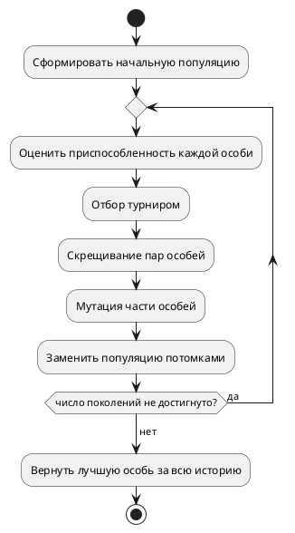
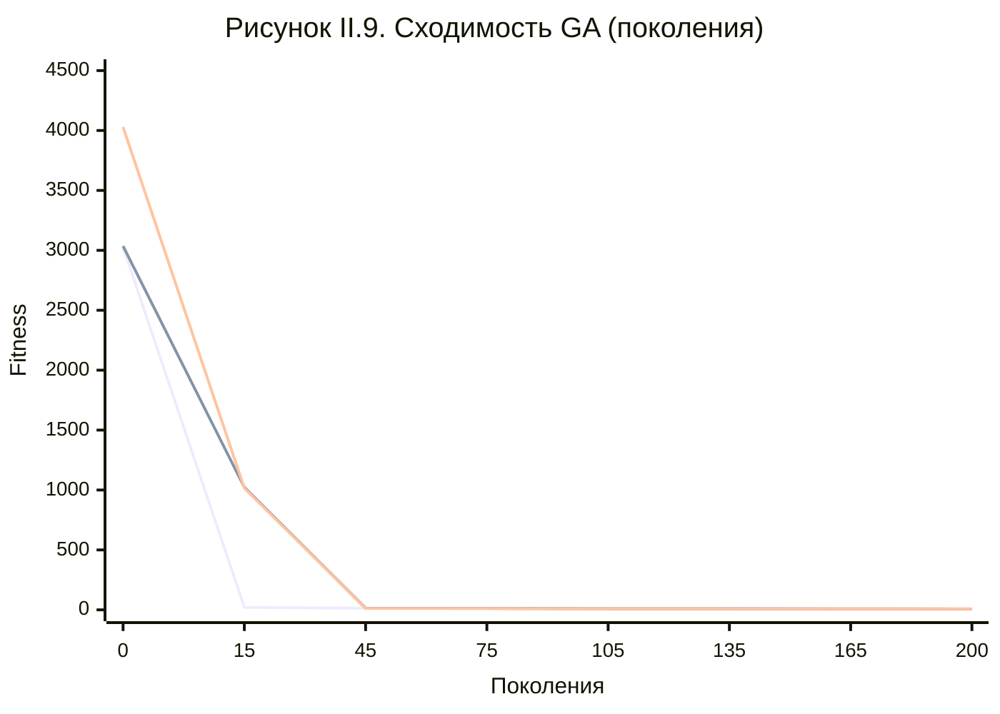
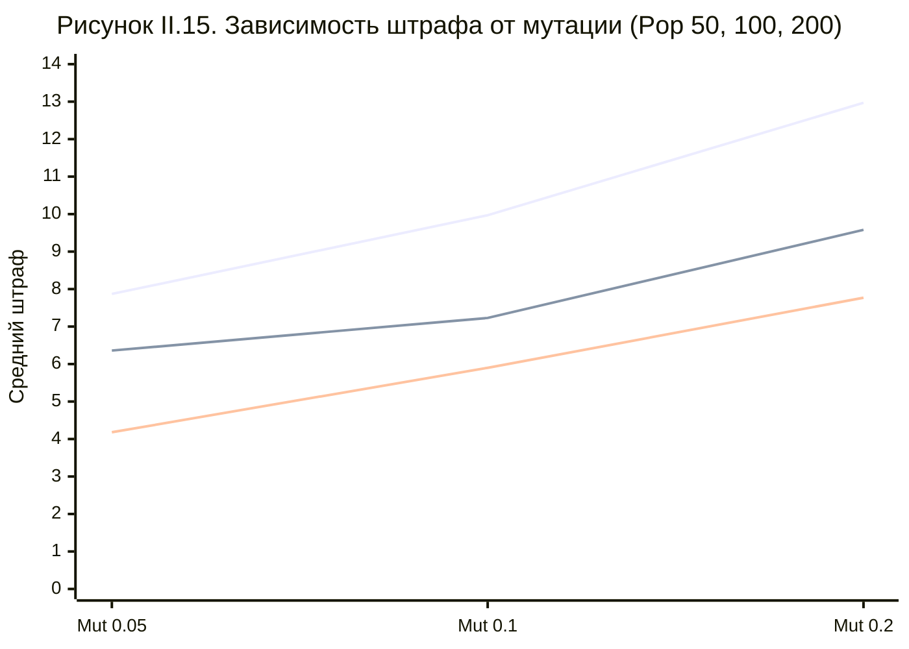

# II.1. Генетический алгоритм (Genetic Algorithm)

## Общие принципы и введение в алгоритм

Генетический алгоритм — это метод оптимизации, заимствующий идею естественного отбора: вместо одного решения одновременно рассматривается целая популяция кандидатов, и на каждом шаге популяция эволюционирует за счёт трёх операций — отбора более удачных особей, скрещивания пар особей с обменом частями решения и случайной мутации отдельных особей. Решения, лучше удовлетворяющие критерию качества (функции приспособленности, fitness), получают больше шансов передать свои черты следующему поколению; решения, удовлетворяющие критерию хуже, со временем вымываются из популяции. В отличие от методов, работающих с одним текущим решением (имитация отжига, поиск с запретами), генетический алгоритм исследует пространство решений сразу в нескольких точках одновременно, что в теории должно снижать риск застревания в локальном оптимуме за счёт разнообразия популяции.

Для реализации генетического алгоритма в данной работе использована библиотека DEAP (Distributed Evolutionary Algorithms in Python) — она не содержит готового решения для задачи расписания, но предоставляет универсальный каркас для построения собственного генетического алгоритма: механизм описания особи, регистрацию операторов отбора, скрещивания и мутации через единый интерфейс `Toolbox`, а также готовую реализацию основного цикла эволюции. Выбор в пользу DEAP, а не написания генетического алгоритма с нуля, обусловлен тем, что библиотека уже решает рутинные технические задачи (инвалидация и повторный расчёт приспособленности только для изменившихся особей, ведение журнала статистики по поколениям, хранение лучшей найденной особи), оставляя для реализации только содержательную часть, специфичную для задачи расписания: представление решения и операторы вариации.

## Особенности реализации

Ключевое архитектурное решение — это способ кодирования решения внутри особи. Поскольку задача расписания дискретна и состоит из независимых решений (для каждого занятия нужно подобрать день, пару, аудиторию и преподавателя), было выбрано прямое позиционное кодирование: особь — это список генов фиксированной длины, равной числу занятий, требующих расстановки, где ген на позиции i всегда относится к одному и тому же, заранее известному занятию. Такое кодирование принципиально отличается от широко распространённого в литературе перестановочного кодирования (как в задаче коммивояжера), потому что порядок занятий в расписании не имеет самостоятельного смысла — смысл имеет только то, какие конкретно день, пара, аудитория и преподаватель присвоены каждому занятию.

```python
class Gene(NamedTuple):
    weekday_id: int
    timeslot_id: int
    audience_id: int
    professor_id: int
```

Второе существенное решение — это то, как оценивается качество особи. Качество расписания в данной работе всегда выражается парой чисел: количество нарушенных жёстких ограничений и суммарный штраф по мягким ограничениям. Библиотека DEAP, однако, ожидает единственное скалярное значение приспособленности, а не пару чисел с приоритетом одного над другим. Чтобы сохранить приоритет жёстких ограничений над мягкими при сведении пары чисел к одному, использован приём масштабирования: число нарушений жёстких ограничений умножается на заведомо большой коэффициент и складывается со штрафом по мягким ограничениям. Это гарантирует, что особь с меньшим числом жёстких нарушений всегда получает лучшую приспособленность независимо от значения мягкого штрафа, и лишь среди особей с одинаковым числом жёстких нарушений сравнение идёт по мягкому критерию.

Основной цикл эволюции выглядит как последовательность из отбора турниром (из каждой случайной группы из трёх особей в следующее поколение проходит лучшая), скрещивания двухточечным обменом блоков генов между парами особей и точечной мутации, при которой каждый ген с небольшой вероятностью полностью перегенерируется заново — то есть для соответствующего занятия заново случайно подбираются день, пара, аудитория и преподаватель, с учётом того, какие преподаватели и аудитории для этого занятия в принципе допустимы.



## Метрики

### Динамика поиска

Сходимость GA характеризуется резким падением функции приспособленности (fitness) на начальных этапах, что соответствует стадии устранения нарушений жестких ограничений (hard constraints). Последующая фаза эволюции популяции характеризуется медленной стабилизацией soft-штрафов, что указывает на переход алгоритма к поиску более качественных решений в допустимой области.

*Рисунок II.9. Сходимость GA: динамика функции Fitness (medium)*



### Компромиссы масштабирования и мутаций

Мы установили, что качество работы генетического алгоритма определяется балансом размера популяции и интенсивности мутаций. Повышение интенсивности мутаций (`gene_mut_indpb`) во всех случаях ведет к деградации итогового решения, так как «разрушение» накопленных структур происходит быстрее, чем их селекция. Оптимальные результаты достигаются при максимальном размере популяции (200) и минимальной вероятности мутации (0.05).

*Рисунок II.15. Влияние вероятности мутации при различных размерах популяции*



## Проблемы, возникшие в процессе реализации

В процессе вычислительного эксперимента на крупном наборе данных, заведомо превышающем физическую вместимость учебной сетки по числу доступных пар, было обнаружено два связанных дефекта реализации, не проявлявшихся на небольших и средних наборах данных. Первый заключался в том, что итоговое расписание, возвращаемое алгоритмом, оказалось короче, чем число занятий, которые требовалось расставить: контейнер, в который складывалось финальное решение, был создан с ограничением на максимальное число занятий, равным вместимости учебной сетки, а не числу занятий в задаче, и при попытке добавить занятий больше, чем позволяет это ограничение, лишние занятия отбрасывались без какого-либо предупреждения. В результате оценка качества расписания и само возвращаемое расписание относились к разным, не совпадающим по длине наборам данных, что приводило к выводу о ложной допустимости заведомо недопустимого решения. Второй дефект обнаружился при устранении первого: один из критериев мягкого качества — компактность занятий в течение дня — вычислялся как разница между шириной диапазона занятых пар и их количеством, что давало отрицательное значение в ситуациях, когда несколько занятий ошибочно претендовали на одну и ту же пару в один и тот же день — то есть именно тогда, когда жёсткое ограничение уже было нарушено. Оба дефекта были выявлены не по абстрактным рассуждениям, а по эмпирически наблюдаемому нарушению базового инварианта: суммарный штраф по мягким критериям не может быть отрицательным числом по построению, поэтому появление отрицательного значения в журнале расчётов послужило прямым сигналом для целенаправленного поиска причины.

Отдельная сложность, не связанная с корректностью, а с производительностью, — это сравнительно высокая вычислительная стоимость одного поколения. Поскольку оценка приспособленности требует полного пересчёта всех критериев по всему расписанию целиком, а популяция на каждом поколении состоит из значительного числа особей, суммарное время работы генетического алгоритма на крупных наборах данных оказалось на порядок выше, чем у альтернативных методов, рассматриваемых в следующих разделах данной главы.

## Выводы по алгоритму

Генетический алгоритм продемонстрировал устойчивую способность находить допустимые решения на небольших и средних по размеру наборах данных, однако стабильно показал худшее качество итогового решения по сравнению с поиском с запретами и имитацией отжига при сопоставимых вычислительных затратах, а по времени работы оказался самым медленным среди всех четырёх реализованных алгоритмов. Это согласуется с теоретическим ожиданием: ведение целой популяции решений даёт устойчивость к локальным оптимумам, но платит за это многократным пересчётом критерия качества на каждом поколении, что особенно заметно при дорогой функции оценки, как в случае расписания. Использование генетического алгоритма в задаче составления расписания целесообразно в первую очередь там, где важна устойчивость результата при существенно различающихся исходных данных и где вычислительное время не является критичным ограничением.
