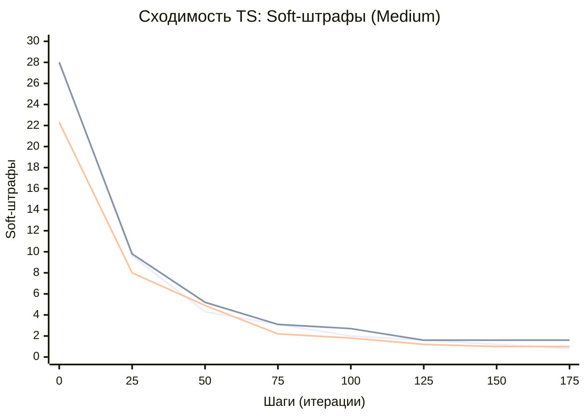
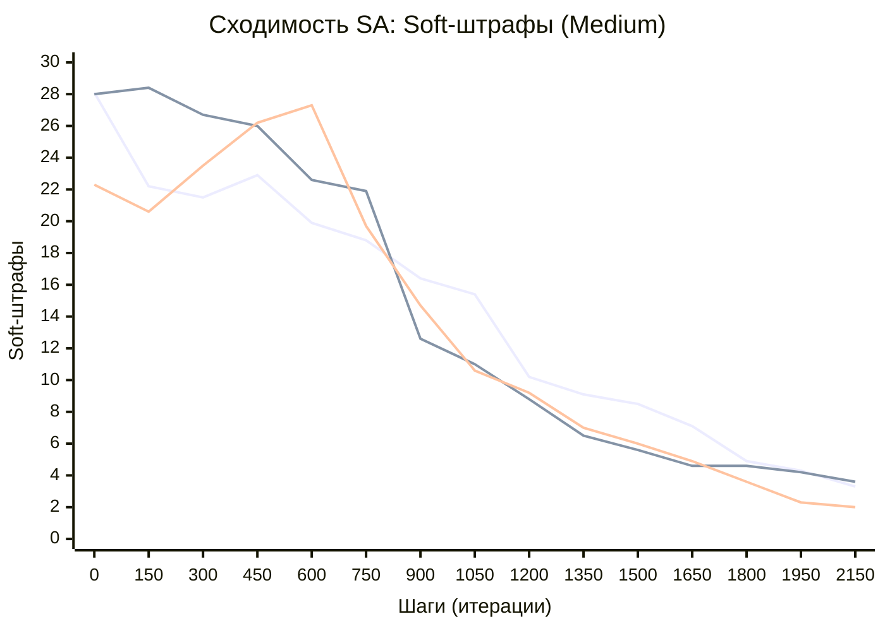
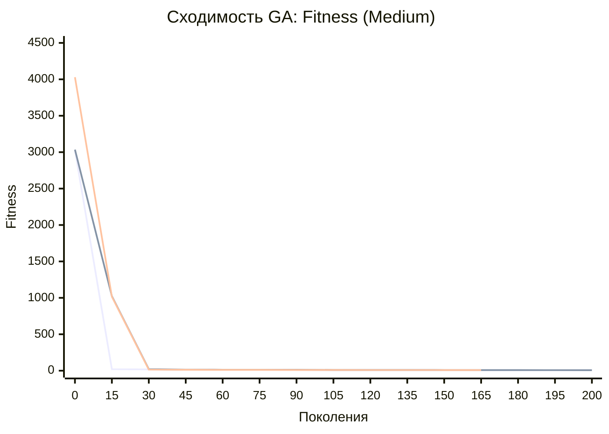

Markdown

### Динамика сходимости эвристик (на примере датасета medium)

На графиках ниже представлена динамика метрик в зависимости от номера шага (итерации/поколения). Каждая линия соответствует отдельному независимому запуску (seed).

#### 1. Tabu Search (TS) — Soft-штрафы

*Характерная форма:* Ступенчатая. Улучшения происходят редко, но крупными скачками, что является прямым следствием выбора лучшего кандидата из батча всей окрестности на каждой итерации. После нахождения локального оптимума график выходит на плато.

#### 2. Simulated Annealing (SA) — Soft-штрафы

Характерная форма: Зашумлённая с плавным затуханием. Вероятностное принятие ухудшающих решений создаёт "шум" на ранних этапах, который постепенно сглаживается по мере охлаждения температуры, медленно сводя метрику к минимуму.
Фрагмент кода

#### 3. Genetic Algorithm (GA) — Скаляризованный Fitness

Характерная форма: Гладкая убывающая кривая. Из-за специфики логирования GA отображается общая функция приспособленности (штрафы hard + soft). Наблюдается резкое падение на первых поколениях (закрытие hard-ограничений) с последующей длительной стагнацией и микро-улучшениями.
Фрагмент кода

