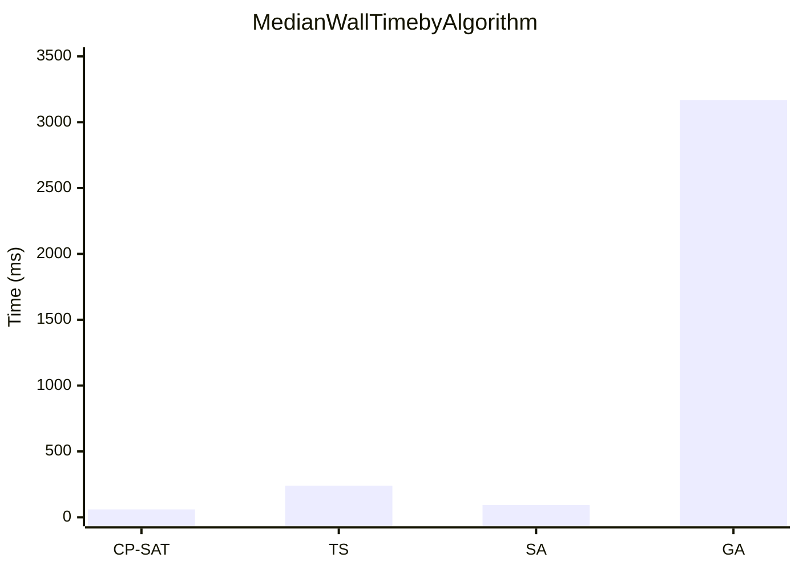
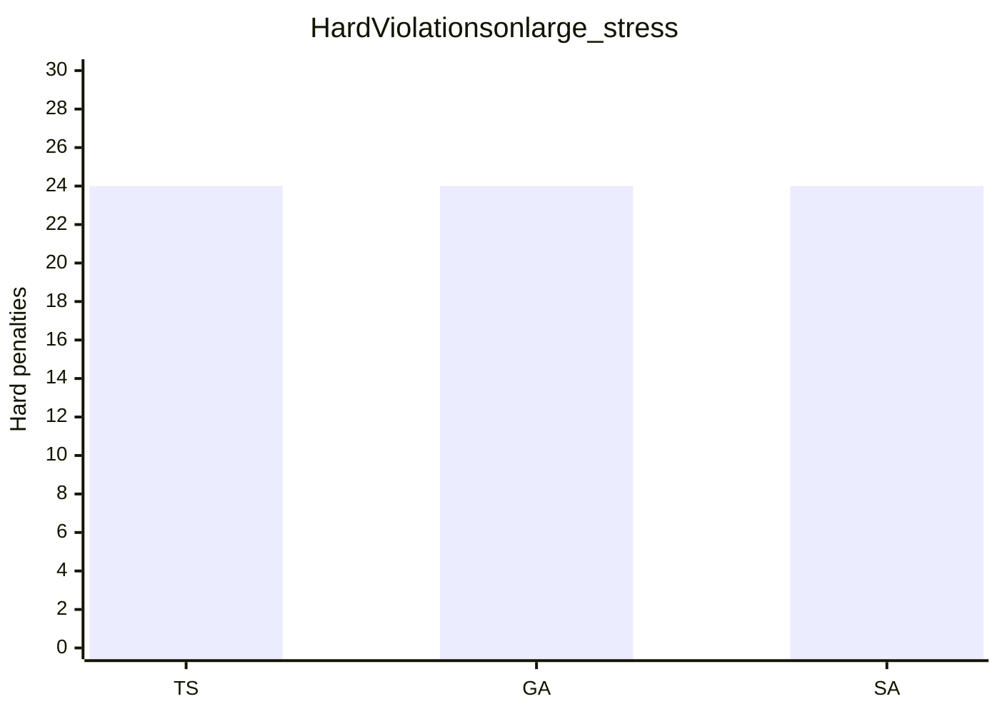

### 1. Разброс Soft-штрафов (Распределение по 10 seed'ам)
*Примечание: Поскольку Mermaid не поддерживает Boxplot, интервалы показывают разброс от минимального до максимального значения soft-штрафа среди 10 прогонов (аналог "усов"). Отлично виден аномальный разброс SA на `tiny_easy`.*

```mermaid
gantt
    title Soft Penalties Spread (Min -> Max) by Dataset
    dateFormat  X
    axisFormat %s

    section tiny_easy (0-2)
    CP-SAT (0.16) : 0, 1
    TS (0.16)     : 0, 1
    GA (0.16)     : 0, 1
    SA (0.16-1.27): 0, 13

    section small_tight (5-6)
    CP-SAT (5.61) : 56, 57
    TS (5.61)     : 56, 57
    GA (5.61)     : 56, 57
    SA (5.61)     : 56, 57

    section medium (0-9)
    CP-SAT (0.79) : 7, 8
    TS (0.79-0.99): 7, 10
    SA (1.95-4.45): 19, 45
    GA (5.79-8.05): 57, 81
```

2. Медианное время выполнения алгоритмов (wall_time_ms)

Примечание: График построен в линейной шкале, так как Mermaid не поддерживает логарифмическую (log-scale) ось Y. Это наглядно иллюстрирует, как GA (занимающий секунды) визуально "съедает" результаты TS, SA и CP-SAT (работающих за миллисекунды).
Фрагмент кода

(Медианы усреднены по всем разрешимым датасетам. GA уходит далеко за пределы 3000+ мс, в то время как остальные алгоритмы едва заметны у нулевой отметки).
3. Нарушения Hard на датасете large_stress

Иллюстрация к тезису: "Все три эвристики сошлись к одному и тому же числу нарушений".
(CP-SAT здесь отсутствует, так как для large_stress статус завершения — INFEASIBLE).
Фрагмент кода

